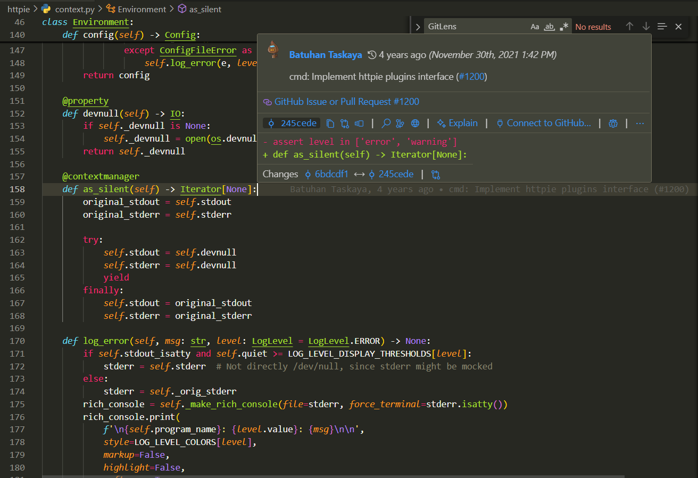

# 🔍 GitLens Detective Insights

## 📄 File Analyzed
- File: `cli/httpie/context.py`
- Function: `as_silent(self) -> Iterator[None]`

## 👤 Author
- Name: Batuhan Taskaya

## 🕒 Last Updated
- Date: November 30, 2021 at 1:42 PM

## 📌 Commit Info
- Commit Hash: 245cede
- Commit Message: cmd: Implement httpie plugins interface(#1200)

## 🖼️ Screenshots
- Screenshot 1: GitLens hover info  
  